# Ex-01_DS_Data_Cleansing
# AIM:
To read the given data and perform data cleaning and save the cleaned data to a file.

# EXPLANATION:
Data cleaning is the process of preparing data for analysis by removing or modifying data that is incorrect ,incompleted , irrelevant , duplicated or improperly formatted. Data cleaning is not simply about erasing data ,but rather finding a way to maximize datasets accuracy without necessarily deleting the information.

# ALGORITHM:
## STEP 1
Read the given Data

## STEP 2
Get the information about the data

## STEP 3
Remove the null values from the data

## STEP 4
Save the Clean data to the file

# CODE:
``` 
Program Developed By : Shrruthilaya G
Register number : 212221230097

import pandas as pd
import numpy as np
import seaborn as sns

data=pd.read_csv("Data_set.csv")
data

data.head()

data.describe()

data.info()

data.tail()

data.shape

data.columns

data.isnull().sum()

data.duplicated()

#Using mode method to fill the data in columns as Object(String)
#mode()[0] - Takes the most reccuring value and fills the empty cells
data['show_name'] = data['show_name'].fillna(data['show_name'].mode()[0])
data['aired_on'] = data['aired_on'].fillna(data['aired_on'].mode()[0])
data['original_network'] = data['original_network'].fillna(data['original_network'].mode()[0])

sns.boxplot(x="rating",data=data)

#Using mean method to fill the data
data['rating'] = data['rating'].fillna(data['rating'].mean())
data['current_overall_rank'] = data['current_overall_rank'].fillna(data['current_overall_rank'].mean())
data['watchers'] = data['watchers'].fillna(data['watchers'].mean())

#Checking the total no.of null values again
data.isnull().sum()

#Checking info of the dataset to check all the columns have entries
data.info()

```
# OUPUT:
### Dataset:
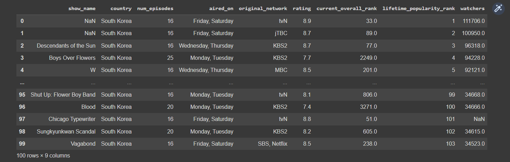

### Head:
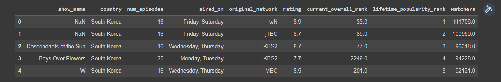

### Describe:
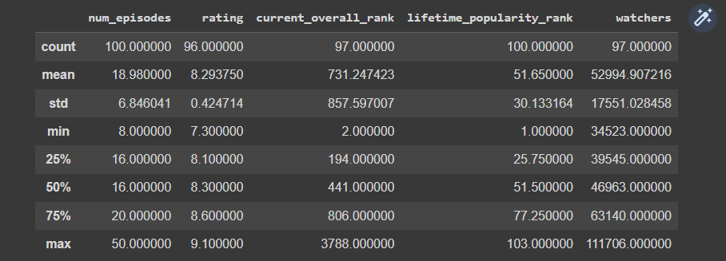

### Pre-cleaning Information:
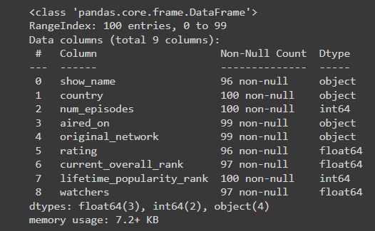

### Tail:
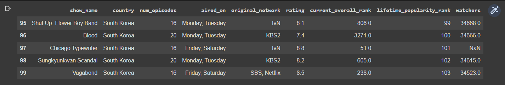

### Shape:


### Column:
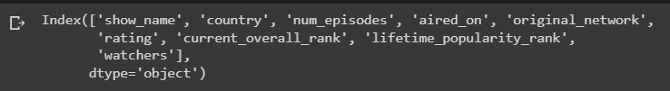

### Pre-cleaning sum:
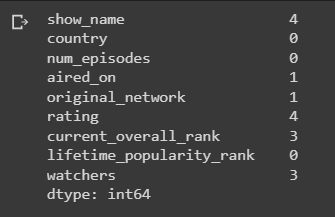

### Duplicate:
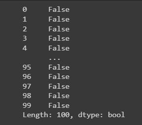

### SNS plot:
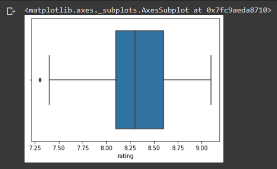

### Post-cleaning sum:
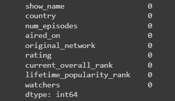

### Post-cleaning Information:
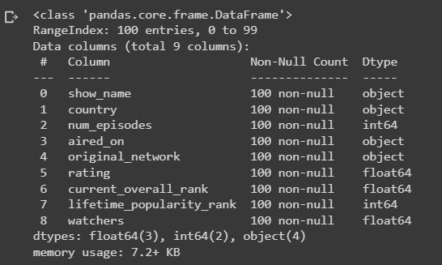

## RESULT:
The given data is read and data cleaning is performed and the cleaned data is saved to a file.